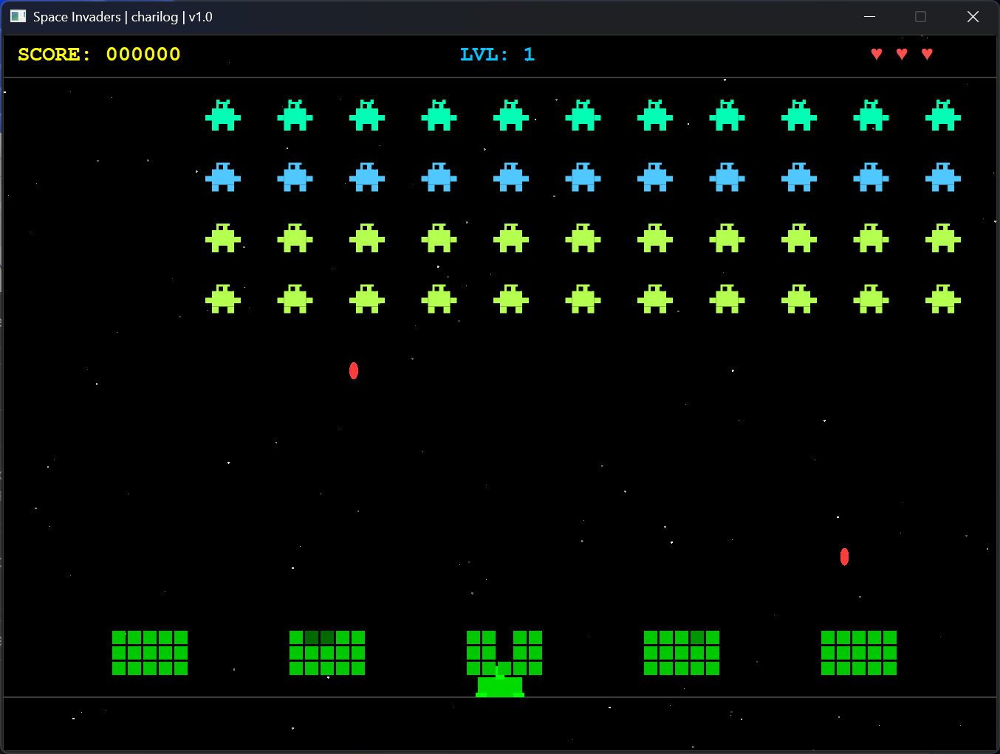

# 👾 Space Invaders

A classic **Space Invaders** arcade game built with **C++17** and **Qt6**, featuring smooth 60fps graphics, animated aliens, destructible shields, and infinite levels.

---

## 📸 Preview



> 900×650 window · Starfield background · Animated alien sprites · Explosion effects

---

## 🎮 Controls

| Key | Action |
|-----|--------|
| `←` / `A` | Move left |
| `→` / `D` | Move right |
| `Space` | Fire |
| `P` | Pause / Resume |
| `Q` / `Esc` | Quit |

---

## ✨ Features

- **44 aliens** in 4 rows × 11 columns with 3 types (30 / 20 / 10 points)
- **2-frame animation** per alien type, drawn with `QPainter`
- **5 destructible shields** with 3 HP each — change colour as they take damage
- **Alien bombs** drop from the bottom of each column randomly
- **Increasing difficulty** — aliens speed up as they are eliminated, bombs drop faster each level
- **Infinite levels** — new wave spawns when all aliens are cleared
- **Explosion flash** effect on hit
- **Starfield** background (120 randomised stars)
- **HUD** showing score, level and remaining lives
- **Splash**, **Pause** and **Game Over** overlay screens
- Custom `.ico` icon (7 sizes: 16 → 256 px) embedded in the `.exe`

---

## 🛠 Requirements

| Dependency | Version |
|------------|---------|
| C++ Standard | C++17 |
| Qt | 6.x (Core, Gui, Widgets) |
| CMake | ≥ 3.16 |
| Compiler | MSVC 2022+ (Windows) / GCC / Clang |

---

## 🚀 Build Instructions

### Windows (Visual Studio + Qt6)

```powershell
cmake -S . -B build -G "Visual Studio 18 2026" -A x64 `
  -DQt6_DIR="C:\Qt\6.10.1\msvc2022_64\lib\cmake\Qt6"

cmake --build build --config Release

.\build\Release\SpaceInvaders.exe
```

> `windeployqt` runs automatically after build and copies all required Qt DLLs next to the `.exe`.
>

> **Windows installer available:** Download and run **SpaceInvaders.exe** from:
>
> **[SpaceInvaders.exe (Windows Installer)](https://www.dit.uoi.gr/files/SpaceInvaders.zip)**

### Linux / macOS

```bash
sudo apt install qt6-base-dev cmake   # Ubuntu
# brew install qt cmake               # macOS

cmake -S . -B build -DCMAKE_BUILD_TYPE=Release
cmake --build build
./build/SpaceInvaders
```

---

## 📁 Project Structure

```
SpaceInvaders/
├── main.cpp              # All game logic & Qt rendering
├── CMakeLists.txt        # Build configuration
├── app.rc                # Windows resource file (icon)
└── space_invaders.ico    # App icon (16–256px, multi-resolution)
```

---

## 🏗 Architecture

The entire game is contained in `main.cpp` and structured around three Qt classes:

- **`InvaderItem`** — `QGraphicsItem` subclass; draws each alien with `QPainter` and supports a 2-frame walk cycle
- **`PlayerItem`** — `QGraphicsItem` subclass; draws the player cannon
- **`GameWindow`** — `QGraphicsView` subclass; owns the game loop (`QTimer` at 16ms), handles input via `keyPressEvent` / `keyReleaseEvent`, and manages all game state

---

## 📜 License

MIT — free to use, modify and distribute.
